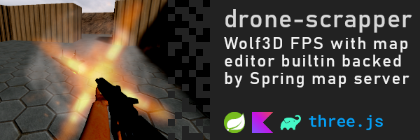

## Hi everyone 👋

I'm a 3rd year student of CS on AGH University in Kraków, keen on learning new stuff.
I love to experiment with different technologies and expressing my creativity through
various, but most importantly, unique projects, spanning from web games and apps, going
down to low-level or even hardware layer.

## My other interests

- 🍰 cooking, especially pastries
- 📖 learning about modern history
- 🚗 cars, and just being petrolhead in general

## Things I would like to do some day

- build d scaleable chat in Elixir or Erlang
- create a wearable app that displays receipies and shows instructions on your wrist.

## Highlights

## Technologies

-  Python: `Pyglet`, `PyTorch`, `Sk-learn`, `numpy`
-  JavaScript and TypeScript: `Canvas` API, `ThreeJS`
-  Web frameworks: `React`, `React Native` `SolidJS`, used `Svelte`, learning `NextJS`
-  Web styling: `Tailwind CSS`, `Headless UI`, learning `DaisyUI`
-  NodeJS: `express`, `fastify`, used `webpack`, switched to `vite`, `Sequlize` and `Prisma` as ORM
-  Java and Kotlin: `JavaFX`, `Swing`, `Spring`, `Hibernate`, `JNI`, very basic Android and WearOS development, using `Compose` or otherwise
-  C: `AVR` and `STM32` microcontrollers, basic OS programming
- :goberserk: Verilog: hardware design on FPGAs (digital circuits)
-  DB: `MySQL`, `PostgreSQL`, `SQLite`, `MongoDB`
-  OS: decent knoweldge of `Linux`, basic of `OpenBSD`
- and a must-know :octocat: `git`
