## Hi everyone 👋

I'm a 3rd year student of CS on AGH University in Kraków, keen on learning new stuff.
I love to experiment with different technologies and expressing my creativity through
various, but most importantly, unique projects, spanning from web games and apps, going
down to low-level or even hardware layer.

## Highlights

[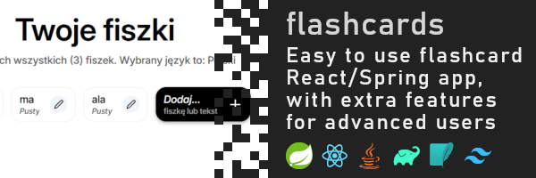](https://github.com/szym-mie/flashcards)
[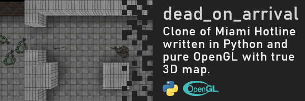](https://github.com/szym-mie/dead_on_arrival)
[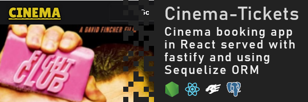](https://github.com/szym-mie/Cinema-Tickets-Szymon-Miekina-Marcin-Walendzik-Ignacy-Siklucki)
[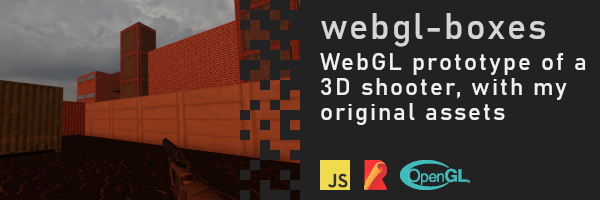](https://github.com/szym-mie/webgl_boxes)
[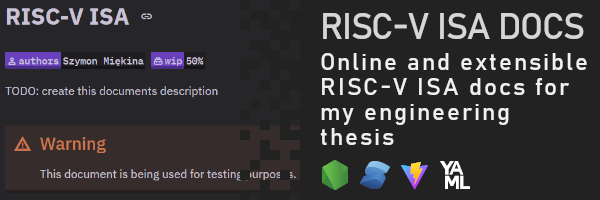](https://github.com/szym-mie/riscv-isa-docs)
[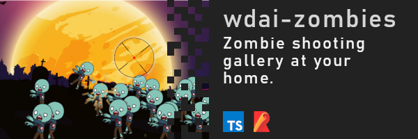](https://github.com/szym-mie/wdai-zombies)
[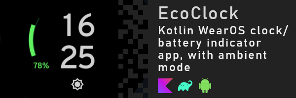](https://github.com/szym-mie/EcoClock)
[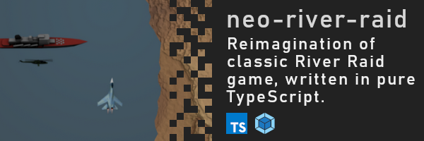](https://github.com/szym-mie/neo-river-raid-ts)
[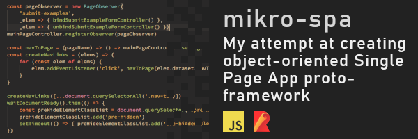](https://github.com/szym-mie/mikro-spa)

[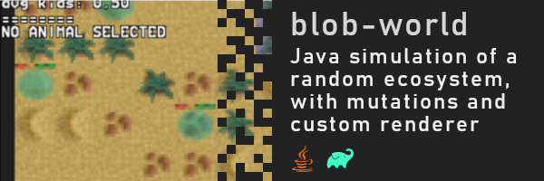](https://github.com/szym-mie/blob-world)
[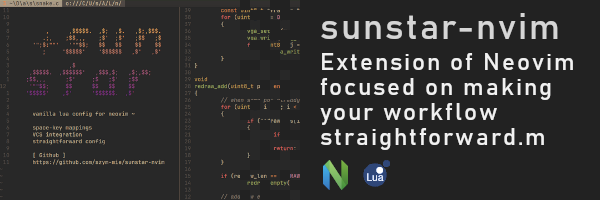](https://github.com/szym-mie/sunstar-nvim)
[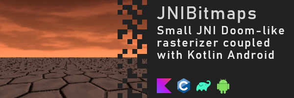](https://github.com/szym-mie/JNIbitmaps)
[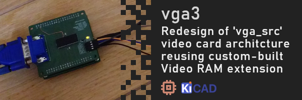](https://github.com/szym-mie/vga3)
[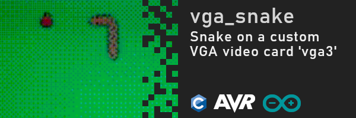](https://github.com/szym-mie/vga_snake)

## Things I would like to do some day

- learn Erlang/Elixir properly to implement a highly scaleable chat, web apps or a game server.
- finally finish my blog engine that has been in making for quite some time.
- then create a 3D version of such blog that reacts to user interactions.
- create a wearable app that displays receipies and cooking instructions on your wrist.
- try my luck at creating minimal linux distro.
- continue expanding my previous projects.

## Technologies

- 🐍 Python: `Pyglet`, `PyTorch`, `Sk-learn`, `numpy`
- 🌐 JavaScript and TypeScript: `Canvas` API, `ThreeJS`
- ⚛️ Web frameworks: `React`, `React Native` `SolidJS`, used `Svelte`, learning `NextJS`
- 🖌️ Web styling: `Tailwind CSS`, `Headless UI`, learning `DaisyUI`
- 🌲 NodeJS: `express`, `fastify`, used `webpack`, switched to `vite`, `Sequlize` and `Prisma` as ORM
- ☕ Java and Kotlin: `JavaFX`, `Swing`, `Spring`, `Hibernate`, `JNI`, very basic Android and WearOS development, using `Compose` or otherwise
- ⚙️ C: `AVR` and `STM32` microcontrollers, basic OS programming
- :goberserk: Verilog: hardware design on FPGAs (digital circuits)
- 🚚 DB: `MySQL`, `PostgreSQL`, `SQLite`, `MongoDB`
- 💻 OS: decent knoweldge of `Linux`, basic of `OpenBSD`
- and a must-know :octocat: `git`
